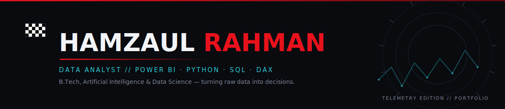
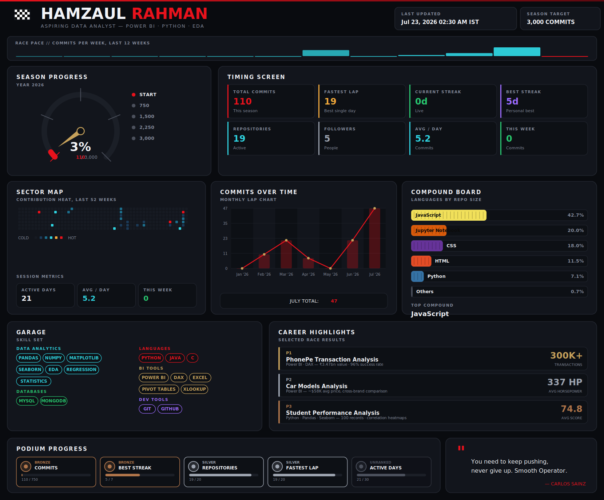
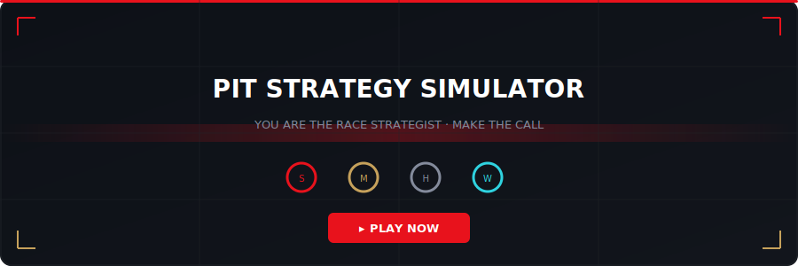

<div align="center">
  
</div>

<div align="center">


<br/>

<a href="https://linkedin.com/in/HamzaulRahman"></a>&nbsp;
<a href="mailto:hamzaulrahman436@gmail.com"></a>&nbsp;
<a href="https://hamzaul.github.io/pit-strategy"></a>

<br/><br/>


&nbsp;&nbsp;

&nbsp;&nbsp;


</div>

<br/>
<div align="center"></div>
<br/>

<!-- ═══════════════════════ SECTION 01 — DRIVER PROFILE ═══════════════════════ -->

<h2 align="center">
&nbsp;&nbsp;DRIVER PROFILE
</h2>

<br/>

```python
class HamzaulRahman:
    """
    Race Engineer · Data Analyst · BI Developer
    ─────────────────────────────────────────────
    Every metric has a story. Every dashboard has a purpose.
    I build systems that turn raw telemetry into race-winning decisions.
    """

    def __init__(self):
        # ── Identity ──────────────────────────────────────────
        self.name           = "Hamzaul Rahman"
        self.role           = "Aspiring Business Intelligence Engineer"
        self.education      = "B.Tech · AI & Data Science — CGC University"
        self.location       = "India"

        # ── Technical Arsenal ─────────────────────────────────
        self.languages      = ["Python", "SQL", "Java", "C", "DAX"]
        self.analytics      = ["Power BI", "Excel", "XLOOKUP", "Pivot Tables"]
        self.data_science   = ["Pandas", "NumPy", "Matplotlib", "Seaborn"]
        self.databases      = ["MySQL", "MongoDB"]
        self.tools          = ["Git", "GitHub", "VS Code", "Figma"]
        self.ai_ml          = ["Linear Regression", "Generative AI", "Responsible AI"]

        # ── Current Focus ─────────────────────────────────────
        self.building       = "Advanced Power BI dashboards with production-grade DAX"
        self.learning       = ["SQL Optimization", "ML Fundamentals", "Statistical Inference"]
        self.exploring      = "Data storytelling frameworks that drive executive decisions"

        # ── Career Trajectory ─────────────────────────────────
        self.career_goals   = [
            "Business Intelligence Engineer",
            "Senior Data Analyst",
            "Power BI Developer"
        ]

        # ── Interests ───────────────────────────────────────
        self.interests      = ["Formula One", "Data Visualization", "Race Strategy", "UI/UX"]

        # ── Philosophy ──────────────────────────────────────
        self.principle      = "A dashboard should answer a question before displaying data."

    def current_season(self) -> str:
        return "2025 — Building the analytics foundation for the next decade."

    def race_strategy(self) -> dict:
        return {
            "short_term": "Master DAX + SQL at production level",
            "mid_term":   "Ship 3 end-to-end BI case studies",
            "long_term":  "Lead a BI team at a data-driven organization",
            "philosophy": "Compound small improvements. Every lap matters."
        }
```

<br/>
<div align="center"></div>
<br/>

<!-- ═══════════════════════ SECTION 02 — DEVELOPER PHILOSOPHY ═══════════════════════ -->

<h2 align="center">
&nbsp;&nbsp;DEVELOPER PHILOSOPHY
</h2>

<br/>

<table align="center">
<tr>
<td width="33%" align="center">

**① CLARITY OVER COMPLEXITY**

A dashboard should answer a question before displaying data.

</td>
<td width="33%" align="center">

**② REDUCE UNCERTAINTY**

Good analytics doesn't create more charts — it eliminates doubt.

</td>
<td width="33%" align="center">

**③ DECISIONS, NOT DATA**

Every visualization must support an action. If it doesn't — delete it.

</td>
</tr>
</table>

<table align="center">
<tr>
<td width="50%" align="center">

**④ COMPOUND IMPROVEMENTS**

You don't win a championship in one race. Small daily improvements compound.

</td>
<td width="50%" align="center">

**⑤ ENGINEER TRUST**

A beautiful dashboard that shows wrong numbers is more dangerous than no dashboard at all.

</td>
</tr>
</table>

<br/>
<div align="center"></div>
<br/>

<!-- ═══════════════════════ SECTION 03 — LIVE TELEMETRY DASHBOARD ═══════════════════════ -->

<h2 align="center">
&nbsp;&nbsp;LIVE TELEMETRY DASHBOARD
</h2>

<br/>

<div align="center">
<sub>
&nbsp;
<b>LIVE</b>&nbsp;&nbsp;·&nbsp;&nbsp;Auto-refreshed via GitHub Actions&nbsp;&nbsp;·&nbsp;&nbsp;Commits, streaks, and language mix are real-time
</sub>
</div>

<br/>

<div align="center">
  
</div>

<br/>
<div align="center"></div>
<br/>

<!-- ═══════════════════════ SECTION 04 — RACE LOG (PROJECTS) ═══════════════════════ -->

<h2 align="center">
&nbsp;&nbsp;RACE LOG — PROJECTS
</h2>

<br/>
<div align="center"><sub>Each project is a race. The data below is the result sheet.</sub></div>
<br/>

<!-- ── P1 ── -->
<table>
<tr><td>

<h3>🏎️&nbsp; P1 — PhonePe Transaction Analysis</h3>

Power BI dashboard analyzing 300K+ transactions worth ₹3.47 billion across 108K users. Drill-through pages break value down by service category. Loans surfaced as the highest-value segment — a finding that would redirect marketing spend.

<p>


</p>

| Metric | Value |
|---|---|
| Difficulty | ████████░░ Advanced |
| Status | ✅ Complete |
| Impact | Identified highest-value segment for targeted strategy |
| Records | 300,000+ transactions |

<a href="https://github.com/Hamzaul/Power_Bi_PhonePay_Analysis_Dashboard"></a>

</td></tr>
</table>
<br/>

<!-- ── P2 ── -->
<table>
<tr><td>

<h3>🏎️&nbsp; P2 — Car Models Analysis</h3>

Cross-filtering dashboard comparing price, mileage, horsepower, and engine specs across brands, transmissions, and fuel types. Users can drill into any combination to compare competitive positioning.

<p>


</p>

| Metric | Value |
|---|---|
| Difficulty | ██████░░░░ Intermediate |
| Status | ✅ Complete |
| Impact | Multi-dimensional comparison across 4 key vehicle metrics |

<a href="https://github.com/Hamzaul/Power_Bi_Car_Models"></a>

</td></tr>
</table>
<br/>

<!-- ── P3 ── -->
<table>
<tr><td>

<h3>🏎️&nbsp; P3 — Student Performance Analysis</h3>

Exploratory data analysis on 100 student records — automated grading, descriptive statistics, and correlation heatmaps across three subjects. Statistical methods reveal which factors most influence academic outcomes.

<p>


</p>

| Metric | Value |
|---|---|
| Difficulty | ██████░░░░ Intermediate |
| Status | ✅ Complete |
| Impact | Correlation analysis surfacing key academic performance drivers |
| Records | 100 students × 3 subjects |

<a href="https://github.com/Hamzaul/Student_Performance_Analysis"></a>

</td></tr>
</table>
<br/>

<!-- ── P4 ── -->
<table>
<tr><td>

<h3>🔐&nbsp; P4 — Authentication System</h3>

Secure user authentication application with registration, login, and session management. Python backend with responsive JavaScript frontend — demonstrates modern auth workflows and access control principles.

<p>


</p>

| Metric | Value |
|---|---|
| Difficulty | ██████░░░░ Intermediate |
| Status | ✅ Complete |
| Impact | Production-ready auth flow with session management |

<a href="https://github.com/Hamzaul/Authentication"></a>

</td></tr>
</table>
<br/>

<!-- ── P5 ── -->
<table>
<tr><td>

<h3>🎂&nbsp; P5 — Birthday Celebration Website</h3>

Interactive birthday celebration website with animated visuals, smooth transitions, and responsive UI. Demonstrates modern front-end animation techniques while creating a memorable user experience.

<p>


</p>

| Metric | Value |
|---|---|
| Difficulty | ████░░░░░░ Beginner |
| Status | 🟢 Live |
| Impact | Animated interactive experience with smooth transitions |

<a href="https://birthday-gules-tau.vercel.app/"></a>
<a href="https://github.com/Hamzaul/Birthday"></a>

</td></tr>
</table>
<br/>

<!-- ── P6 ── -->
<table>
<tr><td>

<h3>🚦&nbsp; P6 — Traffic Control System</h3>

Intelligent traffic control system simulating automated signal management to optimize vehicle flow. Demonstrates practical traffic management logic through an interactive interface with real-time automation.

<p>


</p>

| Metric | Value |
|---|---|
| Difficulty | ██████░░░░ Intermediate |
| Status | ✅ Complete |
| Impact | Real-time signal optimization reducing simulated congestion |

<a href="https://github.com/Hamzaul/Traffic-control-system"></a>

</td></tr>
</table>

<br/>
<div align="center"></div>
<br/>

<!-- ═══════════════════════ SECTION 05 — ENGINEERING GARAGE ═══════════════════════ -->

<h2 align="center">
&nbsp;&nbsp;ENGINEERING GARAGE
</h2>

<br/>
<div align="center"><sub>Every tool has a purpose. Nothing is here for decoration.</sub></div>
<br/>

<div align="center">

<h4>&nbsp;&nbsp;TELEMETRY&nbsp;&nbsp;·&nbsp;&nbsp;Core Languages</h4>
<p>
&nbsp;
&nbsp;
&nbsp;
&nbsp;

</p>
<br/>

<h4>&nbsp;&nbsp;ANALYTICS&nbsp;&nbsp;·&nbsp;&nbsp;BI & Reporting</h4>
<p>
&nbsp;
&nbsp;
&nbsp;

</p>
<br/>

<h4>&nbsp;&nbsp;ENGINE&nbsp;&nbsp;·&nbsp;&nbsp;Data Science</h4>
<p>
&nbsp;
&nbsp;
&nbsp;

</p>
<br/>

<h4>&nbsp;&nbsp;PIT CREW&nbsp;&nbsp;·&nbsp;&nbsp;Databases</h4>
<p>
&nbsp;

</p>
<br/>

<h4>&nbsp;&nbsp;DEVELOPMENT&nbsp;&nbsp;·&nbsp;&nbsp;Tools & Workflow</h4>
<p>
&nbsp;
&nbsp;
&nbsp;

</p>
<br/>

<h4>&nbsp;&nbsp;RACE CONTROL&nbsp;&nbsp;·&nbsp;&nbsp;AI & Machine Learning</h4>
<p>
&nbsp;
&nbsp;

</p>
<br/>

<h4>&nbsp;&nbsp;WEB&nbsp;&nbsp;·&nbsp;&nbsp;Frontend</h4>
<p>
&nbsp;
&nbsp;

</p>

</div>

<br/>
<div align="center"></div>
<br/>

<!-- ═══════════════════════ SECTION 06 — RACE STRATEGY (ROADMAP) ═══════════════════════ -->

<h2 align="center">
&nbsp;&nbsp;RACE STRATEGY — ROADMAP
</h2>

<br/>

<div align="center">

| OBJECTIVE | PROGRESS | STATUS | TARGET |
|---|:---:|:---:|:---:|
| **Power BI · Advanced DAX** | 🟥🟥🟥🟥⬛⬛⬛⬛⬛⬛ 40% |  | Q3 2025 |
| **Machine Learning Fundamentals** | 🟦🟦🟦⬛⬛⬛⬛⬛⬛⬛ 30% |  | Q4 2025 |
| **Statistics for Analytics** | 🟦🟦🟦⬛⬛⬛⬛⬛⬛⬛ 30% |  | Q3 2025 |
| **Data Storytelling** | 🟨🟨⬛⬛⬛⬛⬛⬛⬛⬛ 20% |  | Q4 2025 |
| **SQL Optimization** | 🟨🟨⬛⬛⬛⬛⬛⬛⬛⬛ 20% |  | Q3 2025 |
| **End-to-End BI Case Studies** | 🟥⬛⬛⬛⬛⬛⬛⬛⬛⬛ 10% |  | Q1 2026 |


</div>

<br/>
<div align="center"></div>
<br/>

<!-- ═══════════════════════ SECTION 07 — CURRENT MISSION ═══════════════════════ -->

<h2 align="center">
&nbsp;&nbsp;CURRENT MISSION
</h2>

<br/>

<table align="center">
<tr>
<td width="50%" valign="top">

**🔧 BUILDING**

Advanced Power BI dashboards with production-grade DAX measures, drill-through pages, and row-level security.

</td>
<td width="50%" valign="top">

**📡 LEARNING**

Statistical inference, hypothesis testing, and ML fundamentals — building the math behind the visualizations.

</td>
</tr>
<tr>
<td width="50%" valign="top">

**🔍 EXPLORING**

Data storytelling frameworks that translate analytical findings into executive-level narratives.

</td>
<td width="50%" valign="top">

**⚡ IMPROVING**

SQL query optimization, index strategies, and writing queries that scale to millions of rows.

</td>
</tr>
</table>

<br/>

<div align="center">

**🏁 2026 GOALS**

| # | Objective |
|---|---|
| 01 | Ship 3 production-quality BI case studies with documented business impact |
| 02 | Achieve intermediate ML proficiency — regression, classification, clustering |
| 03 | Launch a portfolio website that functions as a live analytics product |
| 04 | Contribute to 2+ open-source data/analytics projects |

</div>

<br/>
<div align="center"></div>
<br/>

<!-- ═══════════════════════ SECTION 08 — INTERACTIVE GAME ═══════════════════════ -->

<h2 align="center">
&nbsp;&nbsp;PIT STRATEGY SIMULATOR
</h2>

<br/>

<div align="center">


<br/><br/>

**You're the race strategist. The data is your telemetry. Make the call.**

An F1 pit strategy game where you decide when to pit, which tyre compound to choose, and how to respond to weather changes — all based on live data panels. Wrong call? You lose positions. Right call? You win the race.

<br/>

<a href="https://hamzaul.github.io/pit-strategy"></a>
<a href="https://github.com/Hamzaul/pit-strategy"></a>

<br/><br/>

<sub>Built with HTML · CSS · JavaScript &nbsp;|&nbsp; Hosted on GitHub Pages &nbsp;|&nbsp; No dependencies</sub>

</div>

<br/>
<div align="center"></div>
<br/>

<!-- ═══════════════════════ SECTION 09 — GITHUB TELEMETRY ═══════════════════════ -->

<h2 align="center">
&nbsp;&nbsp;GITHUB TELEMETRY
</h2>

<br/>
<div align="center"><sub>Commit history, streaks, and language mix are covered in the live dashboard above.<br/>Below: supplementary activity data.</sub></div>
<br/>

<div align="center">

<picture>
  <source media="(prefers-color-scheme: dark)" srcset="https://raw.githubusercontent.com/Hamzaul/Hamzaul/output/github-snake-dark.svg" />
  <source media="(prefers-color-scheme: light)" srcset="https://raw.githubusercontent.com/Hamzaul/Hamzaul/output/github-snake.svg" />
  
</picture>

<br/><br/>


</div>

<br/>
<div align="center"></div>
<br/>

<!-- ═══════════════════════ SECTION 10 — CONNECT ═══════════════════════ -->

<h2 align="center">
&nbsp;&nbsp;CONNECT
</h2>

<br/>

<div align="center">
<a href="https://linkedin.com/in/HamzaulRahman"></a>
<a href="https://github.com/Hamzaul"></a>
<a href="https://kaggle.com/hamzaulrahman"></a>
<a href="https://leetcode.com/u6sme0wz24"></a>
<a href="https://www.hackerrank.com/@_2501103006"></a>
<a href="mailto:hamzaulrahman436@gmail.com"></a>
<a href="https://hamzaul.github.io/portfolio"></a>
</div>

<br/>
<div align="center"></div>
<br/>

<div align="center">

```
╔══════════════════════════════════════════════════════════╗
║                                                            ║
║   "Data is the new oil.                                   ║
║    But oil is useless until it's refined."                ║
║                                                            ║
║                          — Hamzaul Rahman                 ║
║                                                            ║
╚══════════════════════════════════════════════════════════╝
```

<sub>Engineered with precision. Deployed with intent. Updated on schedule.</sub>

<br/>


</div>
