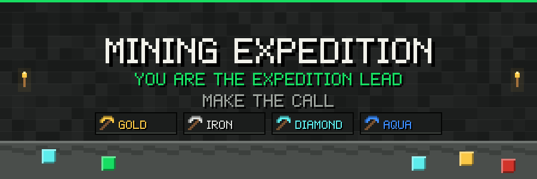

<div align="center">
  
</div>

<div align="center">


```
 ❤️❤️❤️❤️❤️❤️❤️❤️❤️❤️      🍗🍗🍗🍗🍗🍗🍗🍗🍗🍗
 QUEST XP  ████████░░░░░░░░░░░░  40%          LVL: YEAR 2
 > Welcome to my world...
```

<a href="#"></a>
<a href="https://www.linkedin.com/in/hamzaul-rahman-40107b306/"></a>
<a href="https://hamzaul.github.io/portfolio"></a>
<a href="mailto:hamzaulrahman436@gmail.com"></a>

<br/><br/>


&nbsp;

&nbsp;


</div>


<h2 align="center">🧍 PLAYER PROFILE</h2>

<div align="center"><sub><code>player.dat — a decoded save file, same facts as a bio in a different format</code></sub></div>

<br/>

```yaml
# player.dat — decoded
PlayerName: "Hamzaul Rahman"
Class: "Aspiring Data Analyst | AI & Data Science Student"
Spawned: "B.Tech in Artificial Intelligence & Data Science @ CGC University"
CurrentYear: "Year 2 of 4 (2025-2028)"
Biome: "India"

OpenToQuests:
  - Data Analytics Internships
  - Power BI Projects
  - Python Development
  - Open Source Collaboration

Loadout: ["Power BI", "Python", "SQL"]

ActiveQuest: "Advanced DAX, statistics, and cleaner data storytelling"
CurrentlyLearning:
  - Advanced Power BI & DAX
  - SQL Optimization
  - Machine Learning Fundamentals
  - Statistics for Data Analytics

Interests:
  - Business Intelligence
  - Data Visualization
  - Data Analytics
  - Machine Learning
  - Problem Solving
  - Dashboard Design
  - Real-world Data Solutions

SideQuest: "When I'm not building dashboards or solving coding problems, you'll probably find me writing poetry or exploring creative ideas."
Motto: "Turning raw data into decisions worth acting on."
Philosophy: "A dashboard should answer one question clearly"
WorldsBuilt: 6
```


<h2 align="center">🗺️ WORLD ACTIVITY</h2>

<div align="center"><sub><code>Live GitHub data — XP, streaks, chunk map, languages · regenerated every 30 minutes</code></sub></div>

<br/>

<div align="center">
  
</div>

<div align="center"><sub>XP counts GitHub contributions (commits, issues, pull requests and reviews). The 3,000 bar is a personal yearly target, not a calculated figure.</sub></div>


<h2 align="center">🏗️ BUILDS</h2>

<div align="center"><sub><code>6 structures, 6 independent data &amp; dev projects &nbsp;·&nbsp; Tier: ⚪ Common · 🟢 Uncommon · 🔷 Rare</code></sub></div>

<br/>

<table>
<tr>

<td width="50%" valign="top">

#### 🏗️ BUILD 01 &nbsp;·&nbsp; 🔷 RARE

**PhonePe Transaction Analysis**

`300K+ TRANSACTIONS` `₹3.47bn VALUE` `108K USERS`

Power BI dashboard analyzing 300K+ transactions worth ₹3.47bn across 108K users, with KPI cards, dynamic visualizations, and drill-through pages by service category.

  

**Status:** ✅ Completed<br/>
**Impact:** Surfaced loans as the highest-value transaction segment · 96% success rate

[View Build →](https://github.com/Hamzaul/Power_Bi_PhonePay_Analysis_Dashboard)

</td>

<td width="50%" valign="top">

#### 🏗️ BUILD 02 &nbsp;·&nbsp; 🟢 UNCOMMON

**Car Models Analysis**

`PRICE` `MILEAGE` `HORSEPOWER` `ENGINE SPECS` `337 HP` `~$58K AVG PRICE`

Cross-filtering dashboard comparing price, mileage, horsepower, and engine specs across brands, transmissions, and fuel types.

  

**Status:** ✅ Completed<br/>
**Impact:** One comparison view replacing scattered spec sheets

[View Build →](https://github.com/Hamzaul/Power_Bi_Car_Models)

</td>

</tr>
<tr>

<td width="50%" valign="top">

#### 🏗️ BUILD 03 &nbsp;·&nbsp; 🟢 UNCOMMON

**Student Performance Analysis**

`100 STUDENT RECORDS` `3 SUBJECTS` `74.8 AVG SCORE`

Python EDA on 100 student records — grading, descriptive statistics, and correlation heatmaps across three subjects, using Pandas, NumPy, Matplotlib, and Seaborn.

    

**Status:** ✅ Completed<br/>
**Impact:** Flagged a strong Maths–Physics correlation

[View Build →](https://github.com/Hamzaul/Student_Performance_Analysis)

</td>

<td width="50%" valign="top">

#### 🏗️ BUILD 04 &nbsp;·&nbsp; 🟢 UNCOMMON

**Authentication System**

`REGISTRATION` `LOGIN` `SESSION MANAGEMENT`

Secure user authentication app — registration, login, and session management, with a Python backend and a responsive JS frontend.

   

**Status:** ✅ Completed<br/>
**Impact:** End-to-end secure session handling, registration through login

[View Build →](https://github.com/Hamzaul/Authentication)

</td>

</tr>
<tr>

<td width="50%" valign="top">

#### 🏗️ BUILD 05 &nbsp;·&nbsp; ⚪ COMMON

**Birthday Celebration Website**

`LIVE ON VERCEL`

Interactive birthday site with animated visuals, smooth transitions, and a responsive UI.

  

**Status:** 🟢 Live<br/>
**Impact:** Shipped and deployed live, not just a local demo

<a href="https://birthday-gules-tau.vercel.app/">🌐 Live Demo</a> &nbsp;|&nbsp; <a href="https://github.com/Hamzaul/Birthday">View Build →</a>

</td>

<td width="50%" valign="top">

#### 🏗️ BUILD 06 &nbsp;·&nbsp; 🟢 UNCOMMON

**Traffic Control System**

`AUTOMATED SIGNAL MANAGEMENT`

Simulates automated signal management to optimize vehicle flow and reduce congestion, demonstrating automated signal control logic.

    

**Status:** ✅ Completed<br/>
**Impact:** Models signal-timing logic as an alternative to static control

[View Build →](https://github.com/Hamzaul/Traffic-control-system)

</td>

</tr>
</table>


<h2 align="center">⛏️ MINING EXPEDITION</h2>

<div align="center"><sub><code>A small strategy game built with HTML · CSS · JavaScript — in this repo under pit-strategy/</code></sub></div>

<br/>

<div align="center">
  <a href="https://hamzaul.github.io/Hamzaul/pit-strategy/"></a>
</div>

<br/>

Pick the right pickaxe tier, read the tunnels, and decide when to head back to the crafting table. Five rival miners are racing you down 50 blocks to the Deep Vein. Your best result is saved in your browser.

**Live game:** [PLAY MINING EXPEDITION](https://hamzaul.github.io/Hamzaul/pit-strategy/) &nbsp;·&nbsp; **Source:** [`pit-strategy/`](pit-strategy/)


<h2 align="center">🎒 PLAYER INVENTORY</h2>

<div align="center"><sub><code>8 chests · every item in the loadout</code></sub></div>

<br/>

<table align="center" width="92%">
<tr>

<td width="50%" align="center" valign="top">

**⚔️ Programming**

   

</td>

<td width="50%" align="center" valign="top">

**🧱 Web Development**

  

</td>

</tr>
<tr>

<td width="50%" align="center" valign="top">

**💎 Analytics**

    

</td>

<td width="50%" align="center" valign="top">

**🔬 Data Science**

     

</td>

</tr>
<tr>

<td width="50%" align="center" valign="top">

**📈 Visualization**

  

</td>

<td width="50%" align="center" valign="top">

**📦 Databases**

 

</td>

</tr>
<tr>

<td width="50%" align="center" valign="top">

**🛠️ Tools**

  

</td>

<td width="50%" align="center" valign="top">

**✨ Enchanting Table (Currently Learning)**

   

</td>

</tr>
</table>

<div align="center"><sub><code>Chest colors: 🟢 code · 🔷 analytics &amp; data · 🟡 storage · ⚪ tools · 🟣 still being enchanted</code></sub></div>


<h2 align="center">📜 QUEST LOG</h2>

<div align="center"><sub><code>Current learning roadmap</code></sub></div>

<br/>

<div align="center">
<table>
<tr><td width="560">

**▶ ACTIVE QUEST — Advanced Power BI dashboards with production-grade DAX measures**

```
PROGRESS  🟩🟩🟩🟩⬛⬛⬛⬛⬛⬛  40%
```

| Status | Quest |
| :---: | :--- |
| 🟢 ACTIVE | Advanced Power BI & DAX |
| 🟢 ACTIVE | SQL Optimization |
| 🟢 ACTIVE | Machine Learning Fundamentals |
| 🟢 ACTIVE | Statistics for Data Analytics (statistical inference) |
| 🟢 ACTIVE | Deep Learning |
| 🔁 ONGOING | Cleaner data storytelling |

**🔒 LOCKED QUEST (next biome):** Ship the first production-quality BI case study

</td></tr>
</table>
</div>


<h2 align="center">🏆 ADVANCEMENTS</h2>

<div align="center"><sub><code>Milestones, training, and certifications</code></sub></div>

<br/>

<table>
<tr>

<td width="50%" valign="top">

🏆 🟡 **LEGENDARY** — **Data Explorer**<br/>
Year: *(add)*<br/>
6 independent data projects delivered — 3 Power BI dashboards, 3 Python EDA workflows.

</td>

<td width="50%" valign="top">

🏆 🟣 **EPIC** — **Enchanted**<br/>
Year: *(add)*<br/>
Google Cloud's 3-part series: Generative AI, LLMs, and Responsible AI.

</td>

</tr>
<tr>

<td width="50%" valign="top">

🏆 🟢 **UNCOMMON** — **Power Up**<br/>
Year: *(add)* &nbsp;·&nbsp; Certificate awaited<br/>
Summer training — Python, Excel, Power BI.

</td>

<td width="50%" valign="top">

🏆 🟢 **UNCOMMON** — **Certified**<br/>
Year: *(add)*<br/>
PCAP — Programming Essentials in Python.

</td>

</tr>
<tr>

<td width="50%" valign="top">

🏆 ⚪ **COMMON** — **Dungeon Cleared**<br/>
Year: *(add)*<br/>
International DSA Bootcamp — DeepTech track.

</td>

<td width="50%" valign="top">

🏆 ⚪ **COMMON** — **Raid Participant**<br/>
Year: *(add)*<br/>
Smart India Hackathon — HackSTROM, internal round.

</td>

</tr>
</table>


<h2 align="center">🌐 MULTIPLAYER HUB</h2>

<div align="center"><sub><code>Join the server</code></sub></div>

<br/>

<div align="center">

<a href="https://github.com/Hamzaul"></a>
<a href="https://www.linkedin.com/in/hamzaul-rahman-40107b306/"></a>
<a href="https://kaggle.com/hamzaulrahman"></a>
<a href="https://leetcode.com/u6sme0wz24"></a>
<a href="https://www.hackerrank.com/@_2501103006"></a>
<a href="mailto:hamzaulrahman436@gmail.com"></a>
<a href="https://hamzaul.github.io/portfolio"></a>
<a href="#"></a>

</div>


<details>
<summary><b>⚙️ UNDER THE HOOD — how this repository works</b></summary>

<br/>

This repository is both my GitHub profile README and a small automation project. Everything visual is original pixel art generated from code, with no game screenshots or textures and no third-party fonts.

### Architecture

```
GitHub GraphQL API ──► scripts/dashboard.py ──► assets/world-activity.svg ──► README.md
        ▲                       │
   GH_TOKEN secret     .github/workflows/minecraft-dashboard.yml  (every 30 min, commits the SVG)

scripts/pixelfont.py ──► scripts/build_assets.py ──► assets/*.svg, pit-strategy/assets/*
                    └──► scripts/build_font.py   ──► pit-strategy/assets/fonts/blockpix.woff
```

- **World Activity dashboard** (`assets/world-activity.svg`) is generated, so never edit it by hand. It replaces the older snake animation: the chunk map draws the same contribution calendar and also shows daily counts.
- **Static artwork** (hero, divider, game thumbnail, social preview, favicons) is generated by `scripts/build_assets.py`.
- **Mining Expedition** (`pit-strategy/`) is a dependency-free browser game. The folder name is kept so existing links to the deployed game keep working.

### Project structure

```
.github/workflows/minecraft-dashboard.yml   scheduled dashboard refresh
assets/                                      README artwork + generated dashboard
pit-strategy/                                Mining Expedition game
  index.html  css/style.css  js/{tools,flooding,miners,hud,expedition}.js
  assets/    social-preview.png/.svg, favicon set, fonts/blockpix.woff
scripts/                                     dashboard + asset + font generators
requirements.txt  .env.example
```

### Setup

```bash
python -m venv venv && source venv/bin/activate      # Windows: venv\Scripts\activate
pip install -r requirements.txt
cp .env.example .env                                  # then put your token in GH_TOKEN
python scripts/dashboard.py                           # writes assets/world-activity.svg
```

Handy variations:

```bash
python scripts/dashboard.py --placeholder             # empty world, no token needed
python scripts/dashboard.py --demo --out preview.svg  # synthetic data for design checks
pip install cairosvg fonttools && python scripts/build_assets.py && python scripts/build_font.py
```

### Environment variables

| Name | Where | Purpose |
| :--- | :--- | :--- |
| `GH_TOKEN` | local `.env` and the repo's **Actions secret** of the same name | Authenticates the GitHub GraphQL API. Use a read-only token. Never commit it. |

`.env` is git-ignored; `.env.example` is the template.

### GitHub Actions

`minecraft-dashboard.yml` runs on a 30-minute schedule and on manual dispatch. It installs `requirements.txt`, runs `scripts/dashboard.py` with `GH_TOKEN`, then commits `assets/world-activity.svg` with up to 3 push retries. It needs `contents: write` permission.

### Playing the game locally

Open `pit-strategy/index.html` in a browser, or serve the repo folder with `python -m http.server`.

</details>

<br/>

<div align="center">

> *"Data is the new oil."* — widely attributed to mathematician Clive Humby

<sub><code>&gt; World autosaved. Turning raw data into decisions worth acting on, one build at a time.</code></sub>

</div>
